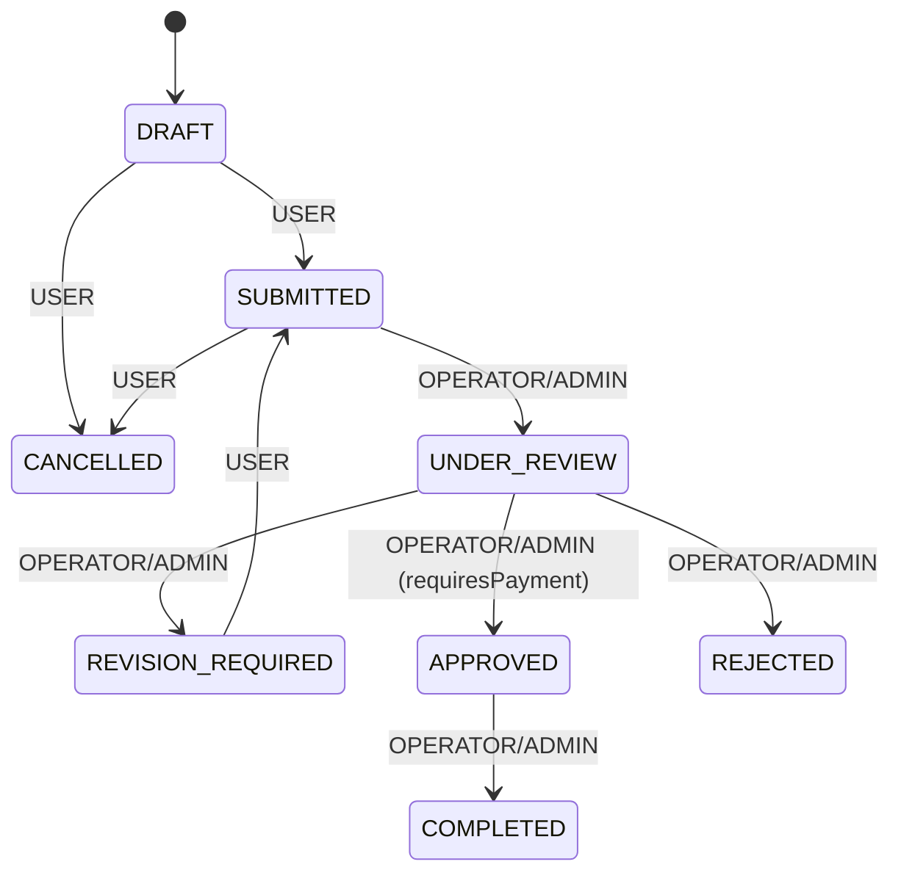

# ATURAN BISNIS — SISTEM INFORMASI PNBP BDI MAKASSAR

---

## 1. STATUS PERMOHONAN (ApplicationStatus)

### 1.1 State Machine



### 1.2 Detail Transisi

| Dari | Ke | Role | Kondisi | Timestamps |
|------|----|----|---------|------------|
| DRAFT | SUBMITTED | USER | — | `submittedAt = now()` |
| DRAFT | CANCELLED | USER | — | — |
| SUBMITTED | UNDER_REVIEW | OPERATOR, ADMIN | — | `reviewedAt = now()` |
| SUBMITTED | CANCELLED | USER | — | — |
| UNDER_REVIEW | REVISION_REQUIRED | OPERATOR, ADMIN | — | `reviewedAt = now()` |
| UNDER_REVIEW | APPROVED | OPERATOR, ADMIN | **Pembayaran harus lunas** | `reviewedAt = now()` |
| UNDER_REVIEW | REJECTED | OPERATOR, ADMIN | `rejectionReason` wajib diisi | `reviewedAt = now()` |
| REVISION_REQUIRED | SUBMITTED | USER | — | `submittedAt = now()` |
| APPROVED | COMPLETED | OPERATOR, ADMIN | — | `completedAt = now()` |

### 1.3 Transisi yang TIDAK Diizinkan

- USER tidak bisa: APPROVED, REJECTED, COMPLETED, UNDER_REVIEW
- OPERATOR tidak bisa: CANCELLED (dari SUBMITTED)
- Tidak ada: COMPLETED → DRAFT, REJECTED → SUBMITTED, CANCELLED → apapun

---

## 2. STATUS PEMBAYARAN (PaymentStatus)

### 2.1 Alur

```
NOT_APPLICABLE → (default jika tidak ada tariff)
AWAITING_PAYMENT → (saat invoice dibuat dengan verified tariff)
PENDING → (saat user mencatat pembayaran)
PAID → (saat operator verifikasi)
FAILED → (saat operator verifikasi gagal)
EXPIRED → (belum diimplementasikan)
REFUNDED → (belum diimplementasikan)
```

### 2.2 Kondisi

| Status | Kondisi |
|--------|---------|
| NOT_APPLICABLE | Service tidak punya verified tariff |
| AWAITING_PAYMENT | Invoice dibuat, menunggu pembayaran |
| PENDING | User sudah mencatat pembayaran, menunggu verifikasi |
| PAID | Operator verifikasi → PAID + invoice paidAmount tercapai |
| FAILED | Operator verifikasi → FAILED |
| EXPIRED | Belum diimplementasikan |
| REFUNDED | Belum diimplementasikan |

---

## 3. PEMBUATAN NOMOR

### 3.1 Nomor Permohonan

- **Format:** `PNBP-YYYYMM-XXXX`
- **Contoh:** `PNBP-202609-0001`
- **Generasi:** `generateApplicationNumber()` di `src/lib/utils.ts`
- **Keunikan:** Tidak atomic-guaranteed — ada retry loop (10x) jika konflik
- **Kekurangan:** Random suffix bisa menghasilkan nomor duplikat pada concurrent request

### 3.2 Nomor Invoice

- **Format:** `INV-<base36-timestamp>`
- **Contoh:** `INV-LXK4F2B`
- **Generasi:** `Date.now().toString(36).toUpperCase()`
- **Keunikan:** Bergantung pada timestamp — bisa konflik pada request concurrent

### 3.3 Nomor Pembayaran

- **Format:** `PAY-<base36-timestamp>`
- **Contoh:** `PAY-LXK4F2C`
- **Generasi:** Sama seperti invoice
- **Keunikan:** Sama — bisa konflik pada concurrent

---

## 4. INVOICE

### 4.1 Pembuatan Invoice

1. Saat user membuat permohonan
2. Cek apakah service punya `ServiceTariff` dengan `verificationStatus: "VERIFIED"`
3. Jika ada → buat Invoice + InvoiceItem
4. Jika tidak → set `paymentStatus: "NOT_APPLICABLE"`

### 4.2 Detail Invoice

| Field | Nilai |
|-------|-------|
| invoiceNumber | `INV-<base36-timestamp>` |
| totalAmount | `tariff.price` |
| paidAmount | `0` (default) |
| status | `PENDING` |
| dueDate | `now() + 7 hari` |

### 4.3 InvoiceItem

| Field | Nilai |
|-------|-------|
| description | `tariff.name` |
| quantity | `1` |
| unitPrice | `tariff.price` |
| totalPrice | `tariff.price` |

---

## 5. VERIFIKASI PEMBAYARAN

### 5.1 Proses

1. Operator klik "Verifikasi" pada pembayaran
2. PATCH `/api/payments/[id]/verify` dengan `{ status: "PAID" }`
3. Prisma transaction: update payment + create PaymentEvent
4. Post-transaction: aggregate `paidAmount` → update invoice → update application

### 5.2 Kondisi

| Kondisi | Hasil |
|---------|-------|
| Payment sudah di target status | Idempotent — return success tanpa reprocess |
| Payment status bukan PENDING | Error 400 |
| Payment tidak ditemukan | Error 404 |

### 5.3 Dampak ke Invoice

- Aggregate semua pembayaran dengan status PAID untuk invoice
- Jika `paidAmount >= totalAmount` → invoice status = PAID
- Jika belum lunas → invoice status tetap PENDING

### 5.4 Dampak ke Application

- Jika invoice PAID → application `paymentStatus = PAID`
- Jika verifikasi FAILED → application `paymentStatus = FAILED`

---

## 6. LAYANAN

### 6.1 Status Layanan

| Status | Deskripsi |
|--------|-----------|
| ACTIVE | Layanan aktif dan dapat dipilih |
| INACTIVE | Layanan tidak aktif |
| UNVERIFIED | Layanan belum diverifikasi |

### 6.2 Penghapusan

- Tidak bisa menghapus layanan yang sudah memiliki permohonan
- Guard check: `prisma.application.count({ where: { serviceId } })`

---

## 7. TARIF

### 7.1 Status Verifikasi

| Status | Deskripsi |
|--------|-----------|
| VERIFIED | Tarif sudah diverifikasi, digunakan untuk auto-invoice |
| UNVERIFIED | Tarif belum diverifikasi (default) |
| PENDING | Menunggu verifikasi |
| EXPIRED | Tarif sudah kedaluwarsa |

### 7.2 Penghapusan

- Tidak bisa menghapus tarif yang sudah digunakan di invoice
- Guard check: `prisma.invoiceItem.count({ where: { tariffId } })`

---

## 8. PENGGUNA

### 8.1 Registrasi

- Role default: `USER`
- Password: bcrypt hash (12 rounds)
- Profile dibuat otomatis dalam transaction

### 8.2 Self-Protection Rules

| Rule | Keterangan |
|------|------------|
| Tidak bisa ubah role sendiri | Mencegah self-demotion |
| Tidak bisa nonaktifkan diri sendiri | Mencegah self-deactivation |
| Tidak bisa hapus diri sendiri | Mencegah self-deletion |

### 8.3 Penghapusan

- User dengan aplikasi → **soft delete** (deactivate, bukan hard delete)
- User tanpa aplikasi → **hard delete**
- Hanya SUPER_ADMIN yang bisa menghapus

---

## 9. AUDIT LOGGING

### 9.1 Mutasi yang Di-audit

| Operasi | Entity | Keterangan |
|---------|--------|------------|
| CREATE | Service, Tariff, Application, Payment, Announcement, FAQ | Semua create |
| UPDATE | Service, Tariff, Announcement, FAQ, User | Semua update |
| DELETE | Service, Tariff, Announcement, FAQ, User | Semua delete |
| STATUS_CHANGE | Application | Perubahan status via state machine |
| VERIFY_PAYMENT | Payment | Verifikasi pembayaran |

### 9.2 Yang TIDAK Di-audit

- `PATCH /api/applications/[id]` (update notes) — tidak ada audit log

### 9.3 Data yang Disimpan

```typescript
{
  userId: string,
  action: string,
  entity: string,
  entityId: string,
  oldData?: Json,  // data sebelum (untuk UPDATE)
  newData?: Json,  // data sesudah
  ipAddress?: string
}
```

---

## 10. CACHE

### 10.1 Queries yang Di-cache

| Query | TTL | Tag | Keterangan |
|-------|-----|-----|------------|
| `getServices()` | 60 detik | `"services"` | `unstable_cache` |
| `getAnnouncements()` | 60 detik | `"announcements"` | `unstable_cache` |
| `getFAQs()` | 60 detik | `"faqs"` | `unstable_cache` |

### 10.2 Queries yang TIDAK Di-cache

- `getApplications()` — user-specific
- `getPayments()` — user-specific
- `getUsers()` — admin-only
- `getAuditLogs()` — admin-only
- `getReportSummary()` — admin-only

---

## 11. PERTANYAAN BISNIS YANG BELUM TERJAWAB

| # | Pertanyaan | Keterangan |
|---|-----------|------------|
| 1 | Apakah data layanan/FAQ publik harus terhubung ke database? | Saat ini hardcoded |
| 2 | Apakah diperlukan halaman publik untuk pengumuman? | Tidak ada |
| 3 | Apa peran spesifik LEADER dan AUDITOR? | Tidak ada fitur khusus |
| 4 | Mekanisme pembayaran resmi seperti apa? | Simulasi manual |
| 5 | Berkas apa saja yang perlu diupload? | Model ada, UI tidak ada |
| 6 | Notifikasi apa saja yang perlu dikirim? | Tidak ada auto-notifikasi |
| 7 | Format laporan apa yang dibutuhkan? | Chart placeholder |
| 8 | Field profil apa saja yang boleh diubah user? | Edit profil belum ada |
| 9 | Apakah perlu email notifikasi? | Tidak ada email service |
| 10 | Apakah perlu payment gateway? | Simulasi manual |
