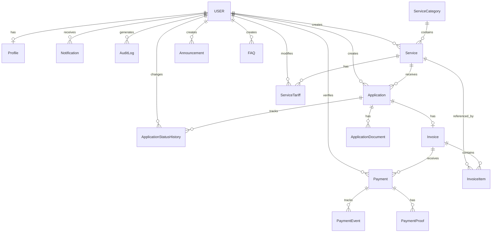

# DOKUMENTASI DATABASE — SISTEM INFORMASI PNBP BDI MAKASSAR

---

## 1. OVERVIEW

- **Database:** PostgreSQL (Neon)
- **ORM:** Prisma 6.12.0
- **Total Models:** 16
- **Total Enums:** 5
- **Schema File:** `prisma/schema.prisma`

---

## 2. ERD (Mermaid)



---

## 3. ENUMS

### 3.1 UserRole

```
PUBLIC | USER | OPERATOR | ADMIN | SUPER_ADMIN | LEADER | AUDITOR
```

- Default: `USER`
- 7 role total, 4 aktif digunakan (USER, OPERATOR, ADMIN, SUPER_ADMIN)

### 3.2 ApplicationStatus

```
DRAFT | SUBMITTED | UNDER_REVIEW | REVISION_REQUIRED | APPROVED | REJECTED | COMPLETED | CANCELLED
```

- Default: `DRAFT`
- 8 status, diatur oleh state machine

### 3.3 PaymentStatus

```
NOT_APPLICABLE | PENDING | AWAITING_PAYMENT | PAID | FAILED | EXPIRED | REFUNDED
```

- Default: `NOT_APPLICABLE`
- 7 status

### 3.4 ServiceStatus

```
ACTIVE | INACTIVE | UNVERIFIED
```

- Default: `ACTIVE`

### 3.5 TariffVerificationStatus

```
VERIFIED | UNVERIFIED | PENDING | EXPIRED
```

- Default: `UNVERIFIED`

---

## 4. MODELS

### 4.1 User

**Tujuan:** Akun pengguna sistem

| Field | Type | Constraint | Keterangan |
|-------|------|------------|------------|
| id | String | PK, cuid | Auto-generated |
| email | String | unique | Email login |
| password | String | | Bcrypt hash (12 rounds) |
| name | String | | Nama lengkap |
| phone | String? | | Nomor telepon |
| nip | String? | unique | Nomor Induk Pegawai |
| instansi | String? | | Nama instansi |
| role | UserRole | default USER | Role pengguna |
| isActive | Boolean | default true | Status aktif |
| createdAt | DateTime | default now() | Waktu pembuatan |
| updatedAt | DateTime | @updatedAt | Waktu update |

**Relations:**
- `profile` → Profile (1:1)
- `applications` → Application (1:N)
- `notifications` → Notification (1:N)
- `auditLogs` → AuditLog (1:N)
- `statusChanges` → ApplicationStatusHistory (1:N)
- `createdServices` → Service (1:N)
- `createdAnnouncements` → Announcement (1:N)
- `createdFAQs` → FAQ (1:N)
- `tariffChanges` → ServiceTariff (1:N)
- `paymentVerifications` → Payment (1:N)

**Indexes:** email, role

---

### 4.2 Profile

**Tujuan:** Data profil pengguna

| Field | Type | Constraint | Keterangan |
|-------|------|------------|------------|
| id | String | PK, cuid | |
| userId | String | unique, FK | Relasi ke User |
| alamat | String? | | Alamat lengkap |
| kota | String? | | Kota |
| provinsi | String? | | Provinsi |
| instansi | String? | | Nama instansi |
| jabatan | String? | | Jabatan |
| foto | String? | | URL foto profil |

**Relations:** `user` → User (N:1, cascade delete)

---

### 4.3 ServiceCategory

**Tujuan:** Kategori layanan

| Field | Type | Constraint | Keterangan |
|-------|------|------------|------------|
| id | String | PK, cuid | |
| name | String | | Nama kategori |
| slug | String | unique | URL slug |
| description | String? | | Deskripsi |
| icon | String? | | Nama icon |
| isActive | Boolean | default true | Status aktif |
| sortOrder | Int | default 0 | Urutan tampil |
| createdAt | DateTime | default now() | |
| updatedAt | DateTime | @updatedAt | |

**Relations:** `services` → Service (1:N)

**Indexes:** slug

---

### 4.4 Service

**Tujuan:** Layanan PNBP yang ditawarkan

| Field | Type | Constraint | Keterangan |
|-------|------|------------|------------|
| id | String | PK, cuid | |
| name | String | | Nama layanan |
| slug | String | unique | URL slug |
| description | String | | Deskripsi |
| targetUser | String? | | Target pengguna |
| requirements | String? | @db.Text | Persyaratan |
| procedure | String? | @db.Text | Prosedur |
| paymentInfo | String? | @db.Text | Info pembayaran |
| cancellation | String? | @db.Text | Kebijakan pembatalan |
| estimationTime | String? | | Estimasi waktu |
| status | ServiceStatus | default ACTIVE | Status layanan |
| isActive | Boolean | default true | Aktif/tidak |
| sortOrder | Int | default 0 | Urutan |
| imageUrl | String? | | URL gambar |
| createdById | String? | FK | Pembuat |
| createdAt | DateTime | default now() | |
| updatedAt | DateTime | @updatedAt | |
| categoryId | String | FK | Kategori |

**Relations:**
- `category` → ServiceCategory (N:1)
- `createdBy` → User (N:1)
- `tariffs` → ServiceTariff (1:N)
- `applications` → Application (1:N)
- `invoiceItems` → InvoiceItem (1:N)

**Indexes:** slug, categoryId, status

---

### 4.5 ServiceTariff

**Tujuan:** Tarif untuk layanan

| Field | Type | Constraint | Keterangan |
|-------|------|------------|------------|
| id | String | PK, cuid | |
| serviceId | String | FK | Layanan terkait |
| name | String | | Nama tarif |
| price | Decimal(15,2) | | Harga |
| unit | String | | Satuan |
| description | String? | | Deskripsi |
| legalBasis | String? | | Dasar hukum |
| regulationNumber | String? | | Nomor regulasi |
| regulationYear | Int? | | Tahun regulasi |
| effectiveStartDate | DateTime | | Tanggal mulai berlaku |
| effectiveEndDate | DateTime? | | Tanggal akhir berlaku |
| verificationStatus | TariffVerificationStatus | default UNVERIFIED | Status verifikasi |
| verifiedById | String? | FK | diverifikasi oleh |
| verifiedAt | DateTime? | | Waktu verifikasi |
| createdById | String? | FK | dibuat oleh |
| createdAt | DateTime | default now() | |
| updatedAt | DateTime | @updatedAt | |

**Relations:**
- `service` → Service (N:1, cascade delete)
- `modifiedBy` → User (N:1)
- `invoices` → InvoiceItem (1:N)

**Indexes:** serviceId, verificationStatus

---

### 4.6 Application

**Tujuan:** Permohonan layanan dari user

| Field | Type | Constraint | Keterangan |
|-------|------|------------|------------|
| id | String | PK, cuid | |
| applicationNumber | String | unique | Nomor unik: PNBP-YYYYMM-XXXX |
| serviceName | String | | Snapshot nama layanan |
| serviceId | String | FK | Layanan |
| userId | String | FK | Pemohon |
| status | ApplicationStatus | default DRAFT | Status permohonan |
| paymentStatus | PaymentStatus | default NOT_APPLICABLE | Status pembayaran |
| notes | String? | @db.Text | Catatan |
| rejectionReason | String? | | Alasan penolakan |
| submittedAt | DateTime? | | Waktu submit |
| reviewedAt | DateTime? | | Waktu review |
| completedAt | DateTime? | | Waktu selesai |
| createdAt | DateTime | default now() | |
| updatedAt | DateTime | @updatedAt | |

**Relations:**
- `service` → Service (N:1)
- `user` → User (N:1)
- `documents` → ApplicationDocument (1:N)
- `statusHistory` → ApplicationStatusHistory (1:N)
- `invoice` → Invoice (1:1)

**Indexes:** applicationNumber, userId, status, serviceId, createdAt

---

### 4.7 ApplicationDocument

**Tujuan:** Berkas lampiran permohonan

| Field | Type | Constraint | Keterangan |
|-------|------|------------|------------|
| id | String | PK, cuid | |
| applicationId | String | FK | Permohonan |
| fileName | String | | Nama file |
| fileUrl | String | | URL file |
| fileSize | Int? | | Ukuran byte |
| mimeType | String? | | Tipe MIME |
| documentType | String? | | Jenis dokumen |
| createdAt | DateTime | default now() | |

**Relations:** `application` → Application (N:1, cascade delete)

**Indexes:** applicationId

**Status:** Model ada, tetapi TIDAK ada UI upload

---

### 4.8 ApplicationStatusHistory

**Tujuan:** Riwayat perubahan status permohonan

| Field | Type | Constraint | Keterangan |
|-------|------|------------|------------|
| id | String | PK, cuid | |
| applicationId | String | FK | Permohonan |
| oldStatus | ApplicationStatus? | | Status sebelumnya |
| newStatus | ApplicationStatus | | Status baru |
| notes | String? | | Catatan perubahan |
| changedById | String? | FK | Pengubah |
| changedAt | DateTime | default now() | Waktu perubahan |

**Relations:**
- `application` → Application (N:1, cascade delete)
- `changedBy` → User (N:1)

**Indexes:** applicationId

---

### 4.9 Invoice

**Tujuan:** Tagihan untuk permohonan

| Field | Type | Constraint | Keterangan |
|-------|------|------------|------------|
| id | String | PK, cuid | |
| invoiceNumber | String | unique | Nomor invoice: INV-<base36> |
| applicationId | String | unique, FK | Permohonan (1:1) |
| totalAmount | Decimal(15,2) | | Total tagihan |
| paidAmount | Decimal(15,2) | default 0 | Total terbayar |
| status | PaymentStatus | default PENDING | Status invoice |
| dueDate | DateTime? | | Jatuh tempo |
| notes | String? | | Catatan |
| createdAt | DateTime | default now() | |
| updatedAt | DateTime | @updatedAt | |

**Relations:**
- `application` → Application (1:1)
- `items` → InvoiceItem (1:N)
- `payments` → Payment (1:N)

**Indexes:** invoiceNumber, applicationId, status

---

### 4.10 InvoiceItem

**Tujuan:** Item detail dalam invoice

| Field | Type | Constraint | Keterangan |
|-------|------|------------|------------|
| id | String | PK, cuid | |
| invoiceId | String | FK | Invoice |
| serviceId | String | FK | Layanan |
| tariffId | String? | FK | Tarif (opsional) |
| description | String | | Deskripsi item |
| quantity | Int | default 1 | Jumlah |
| unitPrice | Decimal(15,2) | | Harga satuan |
| totalPrice | Decimal(15,2) | | Total harga |

**Relations:**
- `invoice` → Invoice (N:1, cascade delete)
- `service` → Service (N:1)
- `tariff` → ServiceTariff (N:1)

**Indexes:** invoiceId

---

### 4.11 Payment

**Tujuan:** Record pembayaran

| Field | Type | Constraint | Keterangan |
|-------|------|------------|------------|
| id | String | PK, cuid | |
| paymentNumber | String | unique | Nomor: PAY-<base36> |
| invoiceId | String | FK | Invoice |
| amount | Decimal(15,2) | | Jumlah bayar |
| paymentMethod | String? | | Metode bayar |
| paymentReference | String? | | Referensi |
| bankName | String? | | Nama bank |
| accountNumber | String? | | Nomor rekening |
| status | PaymentStatus | default PENDING | Status |
| verifiedById | String? | FK | Diverifikasi oleh |
| verifiedAt | DateTime? | | Waktu verifikasi |
| notes | String? | | Catatan |
| paidAt | DateTime? | | Waktu bayar |
| createdAt | DateTime | default now() | |
| updatedAt | DateTime | @updatedAt | |

**Relations:**
- `invoice` → Invoice (N:1)
- `verifier` → User (N:1)
- `events` → PaymentEvent (1:N)
- `proofs` → PaymentProof (1:N)

**Indexes:** paymentNumber, invoiceId, status, createdAt

---

### 4.12 PaymentEvent

**Tujuan:** Event pada lifecycle pembayaran

| Field | Type | Constraint | Keterangan |
|-------|------|------------|------------|
| id | String | PK, cuid | |
| paymentId | String | FK | Payment |
| eventType | String | | SUBMITTED, VERIFIED, FAILED |
| eventData | Json? | | Data tambahan |
| createdAt | DateTime | default now() | |

**Relations:** `payment` → Payment (N:1, cascade delete)

**Indexes:** paymentId

---

### 4.13 PaymentProof

**Tujuan:** Bukti pembayaran (file)

| Field | Type | Constraint | Keterangan |
|-------|------|------------|------------|
| id | String | PK, cuid | |
| paymentId | String | FK | Payment |
| fileName | String | | Nama file |
| fileUrl | String | | URL file |
| fileSize | Int? | | Ukuran byte |
| mimeType | String? | | Tipe MIME |
| description | String? | | Deskripsi |
| createdAt | DateTime | default now() | |

**Relations:** `payment` → Payment (N:1, cascade delete)

**Indexes:** paymentId

**Status:** Model ada, tetapi TIDAK ada UI upload

---

### 4.14 Notification

**Tujuan:** Notifikasi untuk user

| Field | Type | Constraint | Keterangan |
|-------|------|------------|------------|
| id | String | PK, cuid | |
| userId | String | FK | Penerima |
| title | String | | Judul |
| message | String | | Isi pesan |
| type | String | default "info" | info, warning, success |
| isRead | Boolean | default false | Sudah dibaca |
| link | String? | | Link terkait |
| createdAt | DateTime | default now() | |

**Relations:** `user` → User (N:1, cascade delete)

**Indexes:** userId, isRead

**Status:** Model ada, tidak ada mekanisme auto-notifikasi

---

### 4.15 Announcement

**Tujuan:** Pengumuman

| Field | Type | Constraint | Keterangan |
|-------|------|------------|------------|
| id | String | PK, cuid | |
| title | String | | Judul |
| content | String | @db.Text | Konten |
| isPublished | Boolean | default false | Status terbit |
| publishedAt | DateTime? | | Waktu terbit |
| createdById | String? | FK | Pembuat |
| createdAt | DateTime | default now() | |
| updatedAt | DateTime | @updatedAt | |

**Relations:** `createdBy` → User (N:1)

**Indexes:** isPublished

---

### 4.16 FAQ

**Tujuan:** Pertanyaan yang sering diajukan

| Field | Type | Constraint | Keterangan |
|-------|------|------------|------------|
| id | String | PK, cuid | |
| question | String | | Pertanyaan |
| answer | String | @db.Text | Jawaban |
| category | String? | | Kategori |
| sortOrder | Int | default 0 | Urutan |
| isActive | Boolean | default true | Aktif/tidak |
| createdById | String? | FK | Pembuat |
| createdAt | DateTime | default now() | |
| updatedAt | DateTime | @updatedAt | |

**Relations:** `createdBy` → User (N:1)

**Indexes:** category, isActive

---

### 4.17 AuditLog

**Tujuan:** Log aktivitas sistem

| Field | Type | Constraint | Keterangan |
|-------|------|------------|------------|
| id | String | PK, cuid | |
| userId | String? | FK | Pelaku |
| action | String | | CREATE, UPDATE, DELETE, STATUS_CHANGE, VERIFY_PAYMENT |
| entity | String | | Nama model |
| entityId | String? | | ID record |
| oldData | Json? | | Data sebelum |
| newData | Json? | | Data sesudah |
| ipAddress | String? | | IP address |
| userAgent | String? | | User agent |
| createdAt | DateTime | default now() | |

**Relations:** `user` → User (N:1)

**Indexes:** userId, action, entity, createdAt

---

### 4.18 SystemSetting

**Tujuan:** Pengaturan sistem

| Field | Type | Constraint | Keterangan |
|-------|------|------------|------------|
| id | String | PK, cuid | |
| key | String | unique | Nama setting |
| value | String? | | Nilai |
| group | String? | | Grup |
| updatedAt | DateTime | @updatedAt | |

**Indexes:** key, group

**Status:** Model ada, tidak ada UI yang menggunakannya

---

## 5. SEED DATA

Jalankan `npm run db:seed` untuk populate test data:

| Data | Jumlah | Keterangan |
|------|--------|------------|
| Users | 3 | admin, operator, user |
| Categories | 5 | Diklat, Narasumber, Penyewaan, Wisata, Sertifikasi |
| Services | 5 | Pelatihan Penyelia Halal, Pandu Kakao, Jasa Narasumber, Sewa Aula, Wisata Edukasi |
| Tariffs | 1 | Wisata Edukasi Cokelat: Rp 1.000.000/Paket |
| Announcements | 2 | Kedua-duanya published |
| FAQs | 7 | 7 kategori berbeda |

---

## 6. DATABASE INDEXES

Total indexes: 30+

| Model | Indexed Fields |
|-------|----------------|
| User | email, role |
| ServiceCategory | slug |
| Service | slug, categoryId, status |
| ServiceTariff | serviceId, verificationStatus |
| Application | applicationNumber, userId, status, serviceId, createdAt |
| ApplicationDocument | applicationId |
| ApplicationStatusHistory | applicationId |
| Invoice | invoiceNumber, applicationId, status |
| InvoiceItem | invoiceId |
| Payment | paymentNumber, invoiceId, status, createdAt |
| PaymentEvent | paymentId |
| PaymentProof | paymentId |
| Notification | userId, isRead |
| Announcement | isPublished |
| FAQ | category, isActive |
| AuditLog | userId, action, entity, createdAt |
| SystemSetting | key, group |
