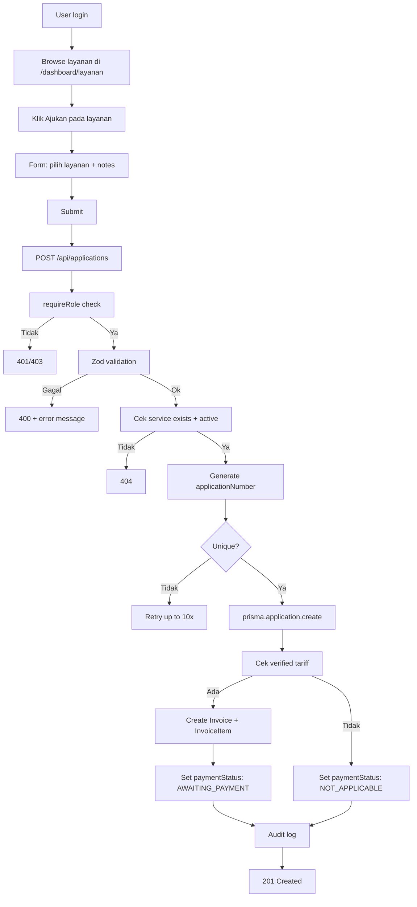

# ALUR PENGGUNA — SISTEM INFORMASI PNBP BDI MAKASSAR

---

## 1. ALUR PENGGUNUNG (PUBLIC)

### 1.1 Alur Umum

```
1. Membuka website (/) → Landing page dengan info layanan
2. Klik "Lihat Layanan" → /layanan (data hardcoded, bukan dari DB)
3. Membaca detail layanan, persyaratan, tarif
4. Klik "Ajukan Sekarang" → /register
5. Mengisi form registrasi → POST /api/auth/register
6. Redirect ke /login → Login dengan akun baru
7. Masuk ke /dashboard
```

### 1.2 Yang Bisa Dilakukan Tanpa Login

| Aksi | Status | Keterangan |
|------|--------|------------|
| Melihat landing page | ✅ | `/` |
| Melihat layanan | ⚠️ | Data hardcoded di `/layanan` |
| Membaca panduan | ✅ | `/panduan` |
| Membaca FAQ | ⚠️ | Data hardcoded di `/faq` |
| Melihat kontak | ✅ | `/kontak` |
| Membaca info pembayaran | ✅ | `/informasi-pembayaran` |
| Melihat pengumuman | ❌ | Tidak ada halaman publik untuk pengumuman dari DB |
| Melihat detail layanan dari DB | ❌ | Hanya data hardcoded |

---

## 2. ALUR USER — MEMBUAT PERMOHONAN

### 2.1 Alur Lengkap



### 2.2 Detail Proses

| Langkah | Proses | Keterangan |
|---------|--------|------------|
| 1 | User browse layanan | Data dari Prisma via `getServices()` |
| 2 | User klik "Ajukan" | Form muncul di `LayananDashboard` |
| 3 | User isi notes (opsional) | Field optional |
| 4 | Submit ke `POST /api/applications` | Body: `{ serviceId, notes }` |
| 5 | Validasi role | `requireRole("USER", "OPERATOR", "ADMIN")` |
| 6 | Validasi input | `applicationSchema` dari Zod |
| 7 | Cek service | Harus exist dan `isActive: true` |
| 8 | Generate nomor | Format `PNBP-YYYYMM-XXXX` dengan random suffix |
| 9 | Cek keunikan | Retry loop maksimal 10x |
| 10 | Simpan application | `prisma.application.create` + `statusHistory.create` |
| 11 | Cek verified tariff | Jika ada → buat Invoice + InvoiceItem |
| 12 | Set paymentStatus | `AWAITING_PAYMENT` atau `NOT_APPLICABLE` |
| 13 | Audit log | `prisma.auditLog.create` |

### 2.3 Penanganan Error

| Kondisi | Respons | Keterangan |
|---------|---------|------------|
| Form tidak lengkap | 400 | Pesan error dari Zod |
| Service tidak ditemukan | 404 | "Layanan tidak ditemukan atau tidak aktif" |
| Nomor konflik | Retry | Generate ulang hingga 10x |
| Server error | 500 | "Gagal membuat permohonan" |

---

## 3. ALUR USER — MEMANTAU STATUS

### 3.1 Melihat Permohonan

```
1. Akses /dashboard/permohonan
2. Server component fetch applications by userId
3. Tabel menampilkan: Nomor, Layanan, Jumlah, Tanggal, Status (badge), Aksi
4. Klik "Lihat" → Detail permohonan
```

### 3.2 Detail Permohonan

```
1. GET /api/applications/[id]
2. Response termasuk: service, user, invoice (items + payments), statusHistory, documents
3. User hanya bisa melihat milik sendiri (ownership check)
```

### 3.3 Update Notes

```
1. PATCH /api/applications/[id]
2. Hanya bisa update notes
3. Hanya untuk status DRAFT atau REVISION_REQUIRED
4. Hanya untuk own applications
```

---

## 4. ALUR USER — PEMBAYARAN

### 4.1 Alur Pembayaran

```mermaid
flowchart TD
    A[User buat permohonan] --> B[Invoice dibuat otomatis]
    B --> C{Ada verified tariff?}
    C -->|Ya| D[paymentStatus: AWAITING_PAYMENT]
    C -->|Tidak| E[paymentStatus: NOT_APPLICABLE]
    D --> F[User akses /dashboard/pembayaran]
    F --> G[User catat pembayaran]
    G --> H[POST /api/payments]
    H --> I[Payment created: status PENDING]
    I --> J[Operator verifikasi]
    J --> K[PATCH /api/payments/[id]/verify]
    K --> L{Status?}
    L -->|PAID| M[Update invoice paidAmount]
    L -->|FAILED| N[Update application paymentStatus: FAILED]
    M --> O[Update invoice status: PAID]
    O --> P[Update application paymentStatus: PAID]
```

### 4.2 Detail Proses

| Langkah | Proses | Endpoint |
|---------|--------|----------|
| User catat pembayaran | `POST /api/payments` | `{ invoiceId, amount, paymentMethod, ... }` |
| Payment dibuat | Status: PENDING, PaymentEvent: SUBMITTED | — |
| Operator verifikasi | `PATCH /api/payments/[id]/verify` | `{ status: "PAID" }` |
| Aggregate paidAmount | Hitung total pembayaran lunas | — |
| Update invoice | Set `paidAmount` + status `PAID` | — |
| Update application | Set `paymentStatus: PAID` | — |

---

## 5. ALUR OPERATOR

### 5.1 Login dan Akses

```
1. Login sebagai OPERATOR
2. Sidebar menampilkan menu admin:
   - Kelola Layanan
   - Kelola Tarif
   - Kelola Permohonan
   - Kelola Pembayaran
   - Pengumuman
   - FAQ
3. Tidak melihat: Pengguna, Laporan, Audit Log, Pengaturan
```

### 5.2 Memproses Permohonan

```mermaid
flowchart TD
    A[Operator login] --> B[Akses /dashboard/kelola-permohonan]
    B --> C[Tabel semua permohonan]
    C --> D[Klik Lihat pada permohonan]
    D --> E[Detail permohonan]
    E --> F{Aksi?}
    F -->|Terima| G[PATCH /api/applications/[id]/status]
    F -->|Revisi| H[PATCH /api/applications/[id]/status]
    F -->|Tolak| I[PATCH /api/applications/[id]/status]
    G --> J{Pembayaran lunas?}
    J -->|Ya| K[Status: APPROVED]
    J -->|Tidak| L[Error: Pembayaran belum lunas]
    H --> M[Status: REVISION_REQUIRED]
    I --> N[Status: REJECTED + rejectionReason]
```

### 5.3 Batasan Kewenangan Operator

| Aksi | Bisa? | Keterangan |
|------|-------|------------|
| Lihat semua permohonan | ✅ | |
| Update status permohonan | ✅ | Sesuai state machine |
| Hapus permohonan | ❌ | Tidak ada endpoint delete |
| Kelola layanan | ✅ | CRUD |
| Kelola tarif | ✅ | CRUD |
| Kelola pengumuman | ✅ | CRUD |
| Kelola FAQ | ✅ | CRUD |
| Verifikasi pembayaran | ✅ | |
| Kelola pengguna | ❌ | Hanya ADMIN+ |
| Lihat laporan | ❌ | Hanya ADMIN+ |
| Lihat audit log | ❌ | Hanya ADMIN+ |
| Pengaturan sistem | ❌ | Hanya ADMIN+ |

---

## 6. ALUR ADMIN

### 6.1 Login dan Akses

```
1. Login sebagai ADMIN atau SUPER_ADMIN
2. Sidebar menampilkan semua menu admin:
   - Kelola Layanan, Kelola Tarif
   - Kelola Permohonan, Kelola Pembayaran
   - Pengguna, Pengumuman, FAQ
   - Laporan, Audit Log, Pengaturan
```

### 6.2 Pengelolaan Layanan

| Aksi | Endpoint | Keterangan |
|------|----------|------------|
| Lihat semua | GET `/api/services` | Public, tanpa auth |
| Buat baru | POST `/api/services` | Admin only, Zod validation |
| Update | PUT `/api/services/[id]` | Admin only |
| Hapus | DELETE `/api/services/[id]` | Blocked jika ada permohonan |

### 6.3 Pengelolaan Tarif

| Aksi | Endpoint | Keterangan |
|------|----------|------------|
| Buat baru | POST `/api/tariffs` | Admin only |
| Update | PUT `/api/tariffs/[id]` | Admin only |
| Hapus | DELETE `/api/tariffs/[id]` | Blocked jika ada invoice |

### 6.4 Pengelolaan Pengguna

| Aksi | Endpoint | Role | Keterangan |
|------|----------|------|------------|
| Lihat detail | GET `/api/users/[id]` | ADMIN+ | |
| Ubah role/status | PUT `/api/users/[id]` | ADMIN+ | Self-protection rules |
| Hapus user | DELETE `/api/users/[id]` | SUPER_ADMIN only | Soft delete jika ada aplikasi |

### 6.5 Self-Protection Rules

| Rule | Keterangan |
|------|------------|
| Tidak bisa mengubah role sendiri | Self-demotion prevention |
| Tidak bisa menonaktifkan diri sendiri | Self-deactivation prevention |
| Tidak bisa menghapus diri sendiri | Self-deletion prevention |
| User dengan aplikasi di-soft delete | Deactivated, bukan dihapus |

---

## 7. ALUR LEADER DAN AUDITOR

### 7.1 Status Saat Ini

**LEADER dan AUDITOR tidak memiliki fitur khusus.**

| Aspek | LEADER | AUDITOR |
|-------|--------|---------|
| Login | ✅ | ✅ |
| Akses dashboard | ✅ | ✅ |
| Menu sidebar | Sama seperti USER | Sama seperti USER |
| Lihat layanan | ✅ | ✅ |
| Buat permohonan | ✅ | ✅ |
| Lihat laporan | ❌ | ❌ |
| Lihat audit log | ❌ | ❌ |
| Kelola data | ❌ | ❌ |

**Catatan:** Role ini ada di database tetapi tidak ada perbedaan akses dibandingkan USER. Perlu keputusan bisnis tentang fitur khusus untuk role ini.
